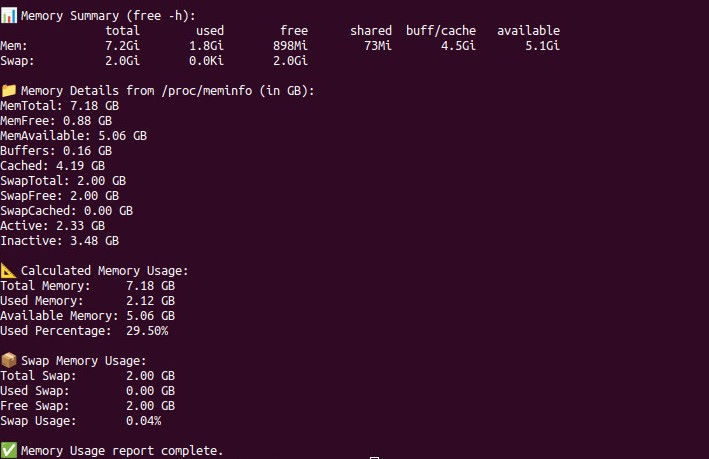

# 🧠 Memory Usage Report

Monitoring memory usage is essential to ensure that your system has enough resources for applications and services. Memory issues can lead to slow performance, crashes, and even system reboots.

This script provides detailed memory and swap usage reports using native Linux tools and `/proc/meminfo`.

---

## 📌 What Is This Script?

`memory_usage_report.sh` is a diagnostic script that collects and summarizes RAM and swap usage in both human-readable and technical detail formats. It calculates memory consumption as a percentage and provides raw data in gigabytes for transparency.

---

## 🎯 Why Monitor Memory?

- Avoid system crashes or freezes due to memory exhaustion.
- Identify applications consuming excess memory.
- Monitor swap usage to detect when physical memory is insufficient.
- Support performance tuning and capacity planning.

---

## 🔍 What This Script Monitors

| Metric                  | Description                                                   |
|--------------------------|---------------------------------------------------------------|
| Free/Used Memory (GB)    | Shows RAM usage with `free -h`.                              |
| /proc/meminfo Fields     | Converts and displays key memory stats from `/proc/meminfo`. |
| Memory Usage %           | Calculates used memory as a percentage of total memory.      |
| Swap Memory Usage        | Shows swap used, free, and percentage utilization.           |

---

## 🧠 How It Works

- Uses `free -h` to display a quick RAM summary.
- Parses key values from `/proc/meminfo` and converts them to gigabytes.
- Computes memory usage percentage based on available vs total memory.
- Displays swap space details with calculated usage percent.

---

## 📈 Why It’s Useful

- Helps detect memory leaks and overuse early.
- Ensures swap space isn’t over-relied upon (which slows down performance).
- Aids in tuning resource-heavy applications or workloads.
- Useful for automating server health audits or daily checks.

---

## 🛠️ How to Use

### 1. Make the script executable:

```bash
chmod +x memory_usage_report.sh
```

### 2. Run the script:

```bash
./memory_usage_report.sh
```

> No additional dependencies required. Works with standard Linux utilities.

---

## 📄 Notes

- Memory is shown in **gigabytes (GB)** for clarity.
- Values pulled directly from kernel interface `/proc/meminfo`.
- No root permissions required to run.

## Sample Image

