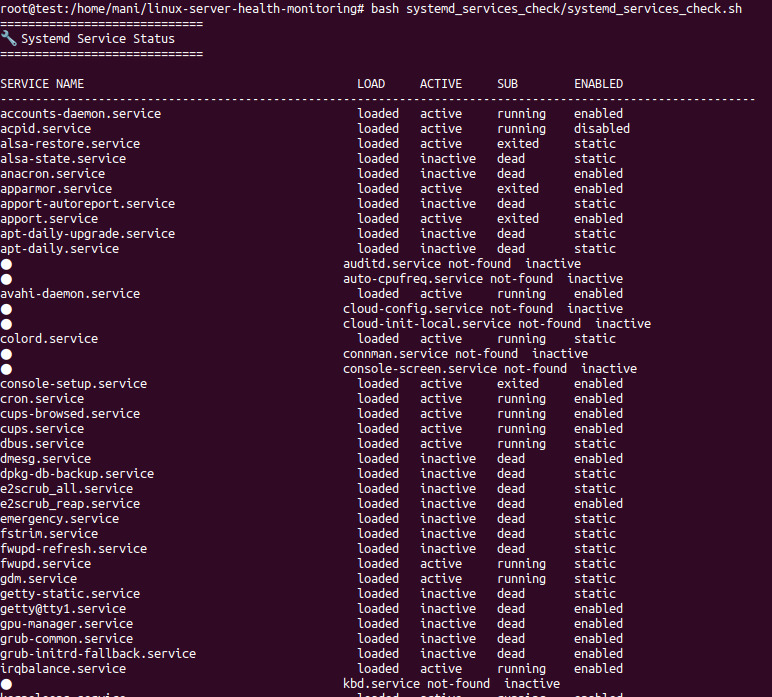

# 🔧 Systemd Service Status

Systemd is the system and service manager for Linux. It is responsible for managing system services, daemons, and user sessions. Monitoring the status of systemd services ensures that essential components are running and functioning properly.

This script provides a detailed overview of the status of all systemd services on your Linux machine.

---

## 📌 What Is This Script?

`systemd_services_check.sh` is a monitoring script that checks the status of all systemd services, including their load, active status, sub-status, and whether they are enabled to start on boot.

---

## 🎯 Why Monitor Systemd Services?

- **System Reliability**: Ensures that critical services are running correctly.
- **Service Debugging**: Helps identify problematic services and dependencies.
- **Startup Management**: Checks if important services are enabled to start automatically at boot.

---

## 🔍 What This Script Monitors

| Metric                  | Description                                                     |
|-------------------------|---------------------------------------------------------------|
| Service Name            | The name of the systemd service.                               |
| Load                    | The load status of the service (e.g., loaded, not-loaded).     |
| Active Status           | Whether the service is currently active (e.g., active, inactive). |
| Sub-status              | Provides additional information on the service’s status (e.g., running, dead). |
| Enabled Status          | Whether the service is enabled to start on boot.               |

---

## 🧠 How It Works

- **Systemd Services List**: The script lists all the systemd services on your machine, showing detailed information for each service, such as whether it's loaded, active, or enabled.
- **Service Status**: It checks the service status, sub-status, and load status of each service.
- **Enabled Check**: It determines whether each service is enabled to start at boot time.

---

## 📈 Why It’s Useful

- **Service Monitoring**: Provides a complete view of the status of all systemd services.
- **System Debugging**: Helps identify services that are not loaded, inactive, or failing.
- **Boot Configuration**: Verifies whether critical services are enabled to start automatically on boot.

---

## 🛠️ How to Use

### 1. Make the script executable:

```bash
chmod +x systemd_services_check.sh
```

### 2. Run the script:

```bash
./systemd_services_check.sh
```

> ⚠️ This script requires root access to check the status of all systemd services, so you may need to run it with `sudo`:

```bash
sudo ./systemd_services_check.sh
```

---

## 📄 Notes

- The script provides an overview of **all** systemd services, including those that are inactive or disabled.
- It outputs each service’s load status, active status, sub-status, and whether it’s enabled to start on boot.
- The output is formatted for easy reading, with columns aligned for clarity.
- This script helps system administrators quickly identify issues with services on the system.

## Sample Image

